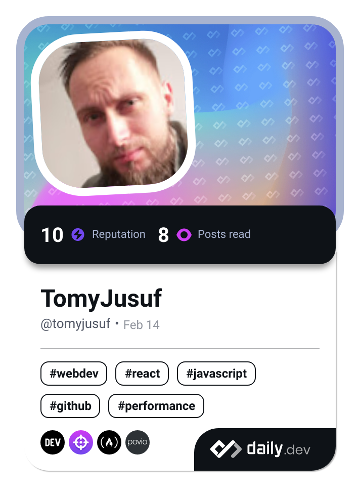

<h1 align="center">
    
</h1>

<h3 align="center">Passion 👨🏻‍💻Frontend Web Developer👨🏻‍💻 for 3 year</h3>
<h3 align="center">I'm born in Czech Republic 🇨🇿 and now I living in Austria 🇦🇹 ❤️</h3>

 

 
 🔭 I’m currently working on **a frontend**
 
 🌱 I’m currently learning **JavaScript, TypeScript, React, MongoDB**

💬 Ask me about \*\*JavaScript, React,(Junior) ...

or anything from my gitHub [here](https://github.com/TomyJusuf)\*\*

 

 
  
 
  <a href="https://salesp07.github.io" target="_blank">
      <!-- sqlite, safari, google-chrome are other good icon options -->
  </a>

<h4 align="center">⚡ Fun fact **China produce the Iphone for 5, and the Apple sell it for 1300 $ $**</h4>

 

 
<h2 align="center">⚒️ Languages-Frameworks-Tools ⚒️</h2>
 

    
     
     

 

  <h2>🐍 My Contributions 🐍</h2>
   
   

   

<h2 align="center">⚡ Stats ⚡</h2>
 

  
  
   
  

  

 

 
<h1 align="center">
    
</h1>
